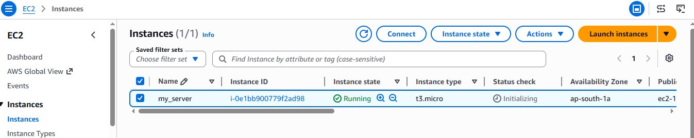
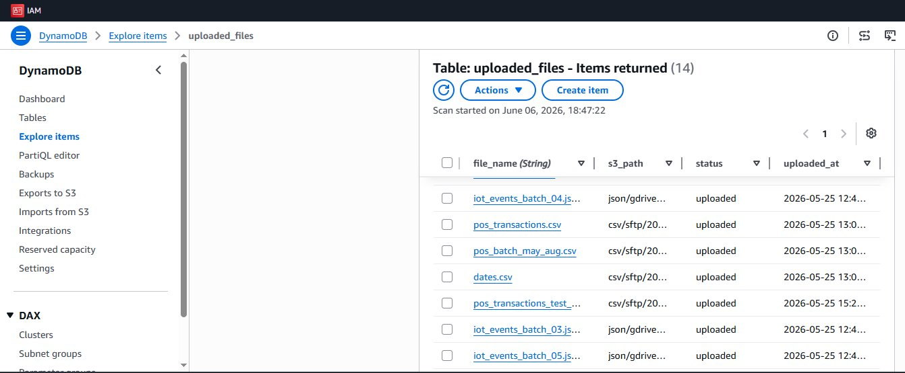
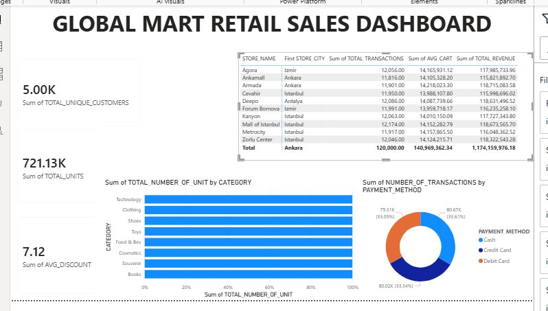
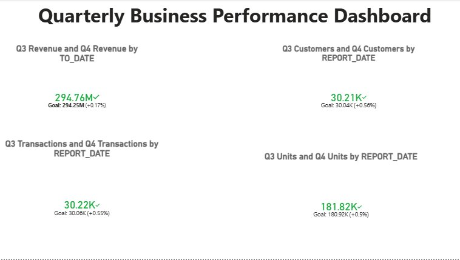

# 🛒 GlobalMart Retail — End-to-End Data Engineering Pipeline

> A production-grade, 5-phase data engineering pipeline ingesting **225,000+ rows** from 3 heterogeneous source systems, running **24/7 on AWS EC2** with full automation, CDC, Time Travel, and a Power BI analytics layer.

[](https://snowflake.com)
[](https://aws.amazon.com)
[](https://python.org)
[](https://powerbi.microsoft.com)

---

## 📐 Architecture Overview

```
Google Drive / FTP Server
        │
        ▼
  [Python Automation]  ──── DynamoDB (dedup tracker)
        │
        ▼
    AWS S3 Bucket
   ┌────┴────┐────┐
  CSV      JSON  Parquet
   │         │     │
   ▼         ▼     ▼
[Snowpipe AUTO_INGEST]
        │
        ▼
  RAW Layer (Bronze)
  csv_data | json_data | parquet_inventory | parquet_orders
        │
        ▼
  Streams + Tasks (CDC)
        │
        ▼
  STAGING Layer (Silver)
  stg_csv_transaction | stg_json_iot | stg_pos_transactions
  stg_erp_inventory   | stg_erp_orders
        │
        ▼
  GOLD_MART Layer (Gold)
  FACT_DELICIONS | FACT_GROSS_MARGIN | FACT_IOT_STORE_DAILY
  FACT_SALES_VERSES_IOT | Views & Materialized Views
        │
        ▼
    Power BI Dashboard
```

---

## 🗂️ Project Structure

```
globalmart-retail/
├── ingestion/
│   ├── monitor_gdrive.py          # Google Drive watcher (5-min polling)
│   ├── monitor_ftp.py             # FTP sync via ftplib passive mode
│   ├── s3_uploader.py             # Dedup-safe S3 upload
│   └── dynamodb_tracker.py        # File fingerprint registry
│
├── snowflake/
│   ├── phase1_setup.sql           # DB, schemas, warehouses, integrations
│   ├── phase2_raw_snowpipes.sql   # Raw tables + Snowpipes
│   ├── phase3_time_travel.sql     # Time Travel + Streams
│   ├── phase4_silver_tasks.sql    # Staging tables + Tasks
│   └── phase5_gold_mart.sql      # Gold tables + Views
│
└── README.md
```

---

## 🔧 Tech Stack

| Layer | Technology |
|---|---|
| Compute | AWS EC2 (24/7) |
| Storage | AWS S3 |
| Dedup Registry | AWS DynamoDB |
| Data Warehouse | Snowflake |
| Ingestion | Snowpipe (AUTO_INGEST) |
| Orchestration | Snowflake Tasks + Streams |
| Transformation | SQL (MERGE, LATERAL FLATTEN) |
| Visualization | Power BI (Direct Connect) |
| Automation | Python 3 |

---

## 🚀 Pipeline Phases

### Phase 1 — Automated Ingestion

A Python daemon runs on EC2 and polls **Google Drive** and an **FTP server** every 5 minutes.

- Files are synced to S3 in their native format (CSV → `csv/sftp/`, JSON → `json/gdrive/`, Parquet → `parquet/sftp/`)
- **DynamoDB** stores a fingerprint (filename + size + modified timestamp) for every uploaded file — the same file is **never uploaded twice**
- Handles FTP in passive mode via `ftplib` (replaced `pysftp` which failed on plain FTP servers)

#### 🖥️ EC2 Instance — Running 24/7 on `ap-south-1a`



> `t3.micro` instance (`my_server`) in `ap-south-1a` (Mumbai) — status **Running**, hosting both the Google Drive and FTP monitor daemons.

#### 🗃️ DynamoDB — File Deduplication Registry



> The `uploaded_files` table tracks every synced file with `file_name`, `s3_path`, `status`, and `uploaded_at`. 14 records shown here — mix of CSV POS files and JSON IoT batches, all marked `uploaded`. Same file will never be re-uploaded.

---

### Phase 2 — Raw Layer (Bronze)

Three external stages point to S3 prefixes. Four **Snowpipes** with `AUTO_INGEST = TRUE` listen for S3 event notifications and load data the moment files land.

| Pipe | Source | Target |
|---|---|---|
| `csv_pipe` | `STG_POS` (CSV) | `RAW.csv_data` |
| `json_pipe` | `STG_IOT` (JSON) | `RAW.json_data` |
| `inventory_pipe` | `STG_ERP` (`*inventory*`) | `RAW.parquet_inventory` |
| `orders_pipe` | `STG_ERP` (`*orders*`) | `RAW.parquet_orders` |

Parquet files land as `VARIANT` columns and are parsed at the Silver layer. A one-time historical backfill with `FORCE = TRUE` loaded all pre-existing files.

---

### Phase 3 — Data Protection

All three **Time Travel** access methods were tested in practice:

```sql
-- Offset-based (60 seconds back)
SELECT COUNT(*) FROM csv_data AT(OFFSET => -60);

-- Timestamp-based
SELECT COUNT(*) FROM csv_data AT(TIMESTAMP => DATEADD(MINUTE,-1,CURRENT_TIMESTAMP()));

-- Statement-based recovery (after accidental UPDATE)
CREATE OR REPLACE TABLE recovered_data AS
SELECT * FROM csv_data BEFORE(STATEMENT => '<query_id>');
```

A table dropped by accident was restored instantly with `UNDROP TABLE erp_inventory_raw`.

Fail-safe analysis via `INFORMATION_SCHEMA.TABLE_STORAGE_METRICS` confirms Permanent tables carry 7-day Fail-Safe while Transient/Temp tables have none.

---

### Phase 4 — Silver Layer (Medallion Architecture)

**Streams** capture changes on every raw table. **Tasks** fire automatically when `SYSTEM$STREAM_HAS_DATA()` returns true — no polling, no wasted credits.

| Task | Stream | Target | Pattern |
|---|---|---|---|
| `task_csv_stream_to_silver` | `CSV_STREAM` | `stg_csv_transaction` | Append-only INSERT |
| `task_json_stream_to_silver` | `JSON_APPEND_STREAM` | `stg_json_iot` | LATERAL FLATTEN on nested readings |
| `task_pos_incremental` | `STREAM_POS_NEW` | `stg_pos_transactions` | Append-only INSERT |
| `task_refresh_buffer` | *(child of pos task)* | `daily_sales_buffer` | MERGE |
| `task_inventory_load` | `STREAM_INVENTORY` | `stg_erp_inventory` | INSERT |
| `task_orders_merge` | `STREAM_ORDERS` | `stg_erp_orders` | MERGE (full CDC) |

Key transformations applied at Silver:
- Negative quantity / price / discount floored to `0`
- `total_orderline` computed as `qty × unit_price × (1 - discount_pct/100)`
- IoT JSON flattened: `LATERAL FLATTEN(INPUT => raw_data:readings)`
- ERP orders use `MERGE` to handle inserts **and** status updates (CDC)

---

### Phase 5 — Gold Layer + Power BI

Gold objects expose analytics-ready data directly to Power BI via Snowflake connector.

| Object | Type | Purpose |
|---|---|---|
| `FACT_DELICIONS` | Table | Daily sales by store, category, region |
| `STORE_REVENUE` | View | Rolling 30-day revenue per store |
| `MATELIZED_VIEW_CATEGORY_BY_REGION` | Materialized View | Category revenue by region (auto-refreshed) |
| `VW_DAILY_SALES_SUMMARY` | View | Daily KPIs (revenue, transactions, AOV) |
| `VW_DAILY_PAYMENT_METHOD_SUMMARY` | View | Revenue split by payment method |
| `FACT_GROSS_MARGIN` | Table | Gross margin % (POS revenue × ERP unit cost) |
| `FACT_IOT_STORE_DAILY` | Table | Daily IoT metrics per store (temp, humidity, footfall, power) |
| `FACT_SALES_VERSES_IOT` | Table | Sales ↔ IoT correlation (joined on store + date) |
| `FACT_KPI_SUMMARY` | View | Single-row global KPI snapshot |

---

## 📊 Power BI Dashboards

### Global Mart Retail Sales Dashboard



> **Live dashboard** connected directly to Snowflake Gold layer. Highlights:
> - **5.00K** unique customers · **721.13K** total units · **7.12** avg discount %
> - Store revenue table: 10 stores across Istanbul, Izmir, Ankara, Antalya — total revenue **₺1.17B**
> - Units by category (Technology leads) and payment method split — Cash / Credit Card / Debit Card nearly equal at ~33% each

---

### Quarterly Business Performance Dashboard



> **Q3 vs Q4 KPI comparison** — all metrics beating Q3 goals:
> - **Revenue:** ₺294.76M vs ₺294.25M goal (+0.17%) ✅
> - **Customers:** 30.21K vs 30.04K goal (+0.56%) ✅
> - **Transactions:** 30.22K vs 30.06K goal (+0.55%) ✅
> - **Units Sold:** 181.82K vs 180.92K goal (+0.50%) ✅

---

## ⚙️ Setup & Deployment

### Prerequisites

- AWS account with EC2, S3, DynamoDB access
- Snowflake account (ACCOUNTADMIN role required for setup)
- Python 3.9+
- Power BI Desktop

### Snowflake Setup

```sql
-- Run in order:
-- 1. phase1_setup.sql           (DB, schemas, warehouses, storage integration, stages)
-- 2. phase2_raw_snowpipes.sql   (raw tables, pipes, backfill)
-- 3. phase3_time_travel.sql     (streams, time travel demo)
-- 4. phase4_silver_tasks.sql    (staging tables, tasks — resume child tasks first!)
-- 5. phase5_gold_mart.sql       (gold tables + views)
```

> **Important:** After creating the Storage Integration, run `DESC INTEGRATION s3_int` and copy the `STORAGE_AWS_IAM_USER_ARN` and `STORAGE_AWS_EXTERNAL_ID` into your IAM trust policy. **Never DROP and recreate the integration** — the External ID changes every time and breaks the trust policy.

### Task Resume Order

```sql
-- Always resume child tasks before root tasks
ALTER TASK STAGING.task_refresh_buffer        RESUME;  -- child first
ALTER TASK STAGING.task_pos_incremental       RESUME;  -- root second
ALTER TASK STAGING.task_csv_stream_to_silver  RESUME;
ALTER TASK STAGING.task_json_stream_to_silver RESUME;
ALTER TASK STAGING.task_inventory_load        RESUME;
ALTER TASK STAGING.task_orders_merge          RESUME;
```

### Python Ingestion (EC2)

```bash
pip install boto3 google-auth google-auth-oauthlib google-api-python-client

# Set environment variables
export AWS_ACCESS_KEY_ID=...
export AWS_SECRET_ACCESS_KEY=...
export S3_BUCKET=global-data-mart-bucket-s3
export DYNAMODB_TABLE=file_tracker

# Start monitor daemons
python ingestion/monitor_gdrive.py &
python ingestion/monitor_ftp.py &
```

---

## 🐛 Lessons Learned

| Problem | Root Cause | Fix |
|---|---|---|
| `pysftp` failing | Plain FTP server (no SSH) | Switched to `ftplib` in passive mode |
| Storage Integration External ID breaking IAM | Every `CREATE OR REPLACE` generates a new External ID | Never drop the integration; `ALTER` it instead |
| APPEND_ONLY stream missing ERP updates | `APPEND_ONLY = TRUE` ignores UPDATEs/DELETEs | Switched ERP streams to Standard CDC (no flag) |
| Tasks not firing | Child task resumed after root | Always resume children first |
| Duplicate stream for csv_data | Phase 3 and Phase 4 both created `csv_stream` | Consolidated to a single `CSV_STREAM` |

---

## 🔍 Validation Queries

```sql
-- Raw layer counts
SELECT COUNT(*) FROM RAW.csv_data;
SELECT COUNT(*) FROM RAW.json_data;
SELECT COUNT(*) FROM RAW.parquet_inventory;
SELECT COUNT(*) FROM RAW.parquet_orders;

-- Silver layer counts
SELECT COUNT(*) FROM STAGING.stg_csv_transaction;
SELECT COUNT(*) FROM STAGING.stg_json_iot;
SELECT COUNT(*) FROM STAGING.stg_erp_orders;

-- Pipe health
SELECT SYSTEM$PIPE_STATUS('RAW.csv_pipe');
SELECT SYSTEM$PIPE_STATUS('RAW.json_pipe');

-- Task history
SELECT * FROM TABLE(INFORMATION_SCHEMA.TASK_HISTORY(TASK_NAME => 'TASK_CSV_STREAM_TO_SILVER'));

-- Stream backlog
SELECT COUNT(*) FROM RAW.CSV_STREAM;
SELECT COUNT(*) FROM RAW.JSON_APPEND_STREAM;
```

---

## 🔗 Links

- **GitHub Repository:** [github.com/divyanshvijay850-prog/-GLOBALMART-RETAIL-SALES](https://github.com/divyanshvijay850-prog/-GLOBALMART-RETAIL-SALES)

---

## 👤 Author

**Divyansh Vijay**  
Data Engineering | Snowflake | AWS | Python | Power BI
